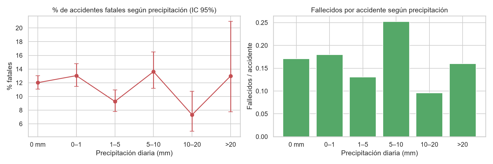
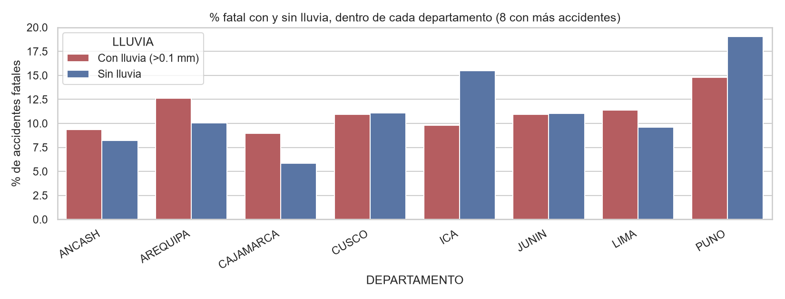
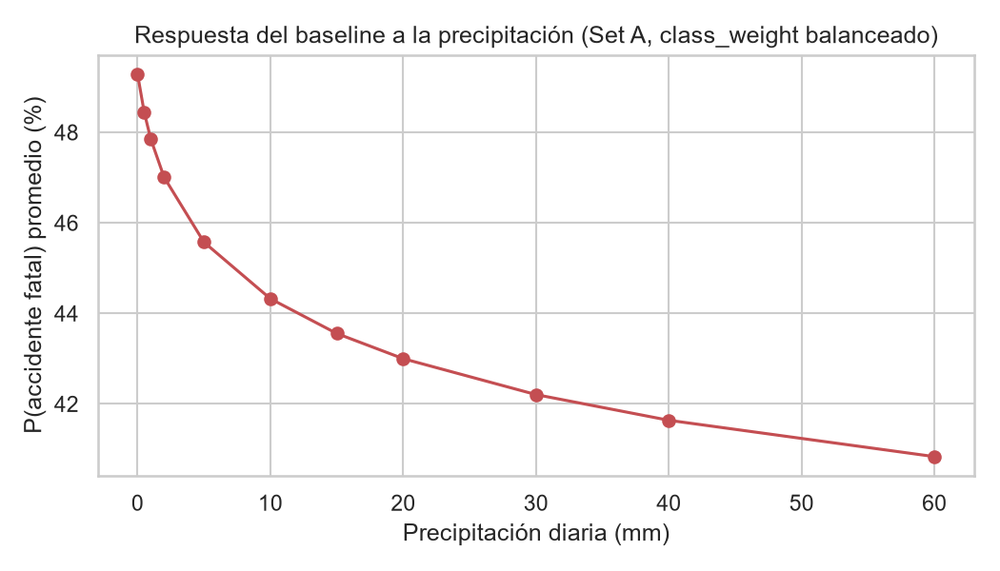

# Mortalidad en carreteras del Perú según el nivel de precipitación

**Curso:** Inteligencia Artificial Aplicada (1INF62) · PUCP · 2026-2
**Integrantes:** Marco Rodriguez, Angel Cerdán, Raul Malaver, Fernando De La Cruz

## Contenido
1. [Problema y objetivo](#1-problema-y-objetivo)
2. [Dataset](#2-dataset)
3. [Revisión de literatura](#3-revisión-de-literatura)
4. [Metodología y propuesta de modelos](#4-metodología-y-propuesta-de-modelos)
5. [Resultados parciales](#5-resultados-parciales)
6. [Cómo ejecutar](#6-cómo-ejecutar)
7. [Estructura del repositorio](#7-estructura-del-repositorio)

---

## 1. Problema y objetivo

Los accidentes en carreteras causan muertes y heridos cada año en el Perú. El país combina costa árida, sierra y selva, con regímenes de lluvia muy distintos, y la precipitación suele asociarse a menor fricción del pavimento y menor visibilidad. Aun así, no está claro **cuánto cambia la mortalidad de un accidente cuando llueve**, ni si ese efecto se mantiene al comparar zonas con climas distintos.

**Pregunta:** ¿cuánta mortalidad hay en una carretera del Perú según el nivel de precipitación?

**Objetivo general:** construir y comparar modelos de inteligencia artificial que estimen la gravedad de los accidentes en carreteras peruanas a partir de la precipitación y de variables de contexto (lugar, hora, época del año).

**Objetivos específicos**
- Integrar el registro de accidentes de SUTRAN con la precipitación diaria de una API climática histórica.
- Caracterizar mediante EDA la relación entre lluvia y fatalidad, controlando por departamento.
- Implementar un baseline y, para el entregable final, modelos propuestos por la literatura.
- Comparar los modelos con métricas adecuadas para datos desbalanceados y discutir limitaciones.

**Formulación.** El dataset contiene solo accidentes ya ocurridos, así que el modelo no estima cuántos accidentes habrá, sino qué tan graves son una vez ocurridos:

| Tarea | Pregunta | Variable objetivo | Baseline |
|---|---|---|---|
| A · Clasificación | Dado un accidente con cierta lluvia, lugar y hora, ¿es fatal? | `ES_FATAL` (`NUM_FALLECIDOS ≥ 1`) | Regresión logística |
| B · Regresión de conteo | ¿Cuántos fallecidos se esperan en ese accidente? | `NUM_FALLECIDOS` | Regresión de Poisson |

---

## 2. Dataset

### 2.1 Origen y permisos
- **Nombre:** Accidentes de Tránsito en Carreteras (2020-2021).
- **Fuente:** Superintendencia de Transporte Terrestre de Personas, Carga y Mercancías (**SUTRAN**), publicado en la Plataforma Nacional de Datos Abiertos del Estado Peruano: <https://www.datosabiertos.gob.pe/dataset/accidentes-de-tr%C3%A1nsito-en-carreteras>
- **Contenido:** accidentes en vías nacionales y departamentales reportados por la Policía Nacional del Perú (PNP) y el Centro de Gestión y Monitoreo (CGM) de SUTRAN. Cada fila es un accidente.
- **Corte de la información:** 22/12/2021 (`FECHA_CORTE = 20211222`); el portal indica última modificación el 28/01/2022.
- **Licencia:** Open Data Commons Attribution (ODC-By). Es un dato público sin datos personales; se puede usar citando la fuente. No se requiere consentimiento adicional.
- **Tamaño:** 8 155 registros y 9 columnas en el CSV original. En la limpieza se descartan 3 sin dato de fallecidos, 7 sin departamento (sin departamento no se puede asignar lluvia) y 35 duplicados exactos; quedan **8 110 registros**, todos con dato de lluvia, que son los que usan el EDA y los modelos (`data/processed/accidentes_clima.csv`).
- **Periodo real de los accidentes:** 01/01/2020 – 30/09/2021. La fecha de corte es el 22/12/2021, pero el archivo no contiene accidentes posteriores al 30/09/2021.
- **Archivo en el repo:** `data/raw/accidentes_transito_carreteras.csv` y su diccionario oficial en `data/raw/diccionario_de_datos.docx`.

### 2.2 Variables (según el diccionario de datos oficial)

| Variable | Descripción | Tipo | Tamaño | Observaciones del diccionario |
|---|---|---|---|---|
| `FECHA_CORTE` | Fecha de corte de la información | Numérico (AAAAMMDD) | 8 | |
| `FECHA` | Fecha del accidente de tránsito | Numérico (AAAAMMDD) | 8 | |
| `HORA` | Hora del accidente (HH:MM) | Numérico | 5 | "N.I." = no identificado: 88 accidentes sin hora |
| `DEPARTAMENTO` | Departamento donde ocurrió el accidente | Texto | 13 | 7 accidentes sin departamento |
| `CODIGO_VIA` | Código de la vía donde se reportó el accidente | Alfanumérico | 6 | 46 accidentes sin código de vía |
| `KILOMETRO` | Kilómetro de la vía donde se reportó el accidente | Numérico | 4 | 45 accidentes sin kilómetro |
| `MODALIDAD` | Atropello, choque, despiste, especial, volcadura o N.I. | Texto | 9 | 28 accidentes sin modalidad |
| `NUM_FALLECIDOS` | Número de personas reportadas como fallecidas | Numérico | 2 | 3 accidentes sin dato de fallecidos |
| `NUM_HERIDOS` | Número de personas reportadas como heridas | Numérico | 2 | 10 accidentes sin dato de heridos |

**Diferencias entre el diccionario y el archivo real** (el notebook las corrige automáticamente):
- En el CSV, las columnas se llaman `CODIGO_VM-MA` (encabezado con la tilde dañada, equivale a `CODIGO_VIA`), `FALLECIDOS` y `HERIDOS`.
- Separador `;`, codificación ISO-8859-1 (latin-1) y saltos de línea CRLF.
- Fecha como `AAAAMMDD` y hora como `HH:MM`.
- Los valores "N.I." se tratan como datos faltantes.

### 2.3 Dataset complementario: precipitación
El registro de accidentes no tiene clima ni coordenadas. La lluvia se obtiene de la **API histórica de Open-Meteo** (<https://open-meteo.com/en/docs/historical-weather-api>), que entrega precipitación diaria por coordenadas, sin API key. Para cada departamento se descarga la precipitación diaria acumulada (`precipitation_sum`, en mm) en la capital del departamento y se une con los accidentes por **departamento + fecha**. Open-Meteo es gratuito para uso no comercial y exige atribución (revisar los términos vigentes).

### 2.4 Limitaciones del dataset
- **Resolución espacial de la lluvia:** el dataset no trae coordenadas, solo departamento, vía y kilómetro. La lluvia se mide en la capital del departamento, lo que es un proxy grueso en departamentos extensos (Loreto, Cusco, Puno, Junín).
- **Origen de la lluvia:** los valores de la API provienen de datos de reanálisis, no de estaciones; pueden diferir de las mediciones de SENAMHI, sobre todo en la zona andina.
- **Solo accidentes:** no hay información de tráfico ni de días sin accidentes, por lo que no se puede estimar la probabilidad de que ocurra un accidente, solo su gravedad.
- **Periodo enero 2020 – septiembre 2021:** coincide con la pandemia (restricciones de movilidad); en el EDA, abril de 2020 cae a ≈ 20 fallecidos, coherente con la cuarentena.
- **Datos faltantes y posible subregistro** (valores "N.I.").

---

## 3. Revisión de literatura

Cada integrante revisó un artículo revisado por pares sobre predicción de fatalidad o gravedad, o sobre búsqueda de patrones en accidentes viales, que no usa el mismo dataset que nosotros. Los PDF están en [`papers/`](papers/) (índice en [`papers/README.md`](papers/README.md)).

### Paper 1 · Marco Rodriguez · [`paper_integrante1.pdf`](papers/paper_integrante1.pdf)
**K. V. Mhetre y A. D. Thube**, "Count Data Modeling for Predicting Crash Severity on Indian Highways", *Engineering, Technology & Applied Science Research*, vol. 13, n.º 5, pp. 11816-11820, 2023. DOI: [10.48084/etasr.6172](https://doi.org/10.48084/etasr.6172)

- **Problema:** predecir la fatalidad de accidentes en una carretera nacional rural de la India (NH-48, Maharashtra, ~265 km) según la naturaleza del choque, el horario (AM/PM) y el clima.
- **Datos:** registros de la National Highways Authority of India, 2016-2020. División 70 % entrenamiento / 30 % validación.
- **Técnica:** regresión **binomial negativa** (extiende Poisson a conteos con sobredispersión). Cuatro modelos: naturaleza del choque, horario, condición climática (fino, nublado, llovizna, lluvia fuerte, neblina) y choque + horario. Validación con log-verosimilitud, AIC, BIC, MAD, MSE, RMSE y MAPE.
- **Resultados:** la naturaleza del choque y el clima resultaron significativos; lluvia ligera y fuerte, neblina, tiempo fino y nublado aparecen asociados positivamente con la fatalidad. Los modelos 2 y 4 ajustaron mejor.
- **Aporte a nuestro proyecto:** respalda modelar `NUM_FALLECIDOS` como **conteo** (usamos Poisson como baseline y proponemos binomial negativa para el final) y confirma el clima como variable relevante. **Crítica:** usa el clima como categorías y no aísla un efecto propio de la lluvia; nosotros usamos precipitación continua en mm y evaluamos en datos de prueba.

### Paper 2 · Angel Cerdán · [`paper_integrante2.pdf`](papers/paper_integrante2.pdf) (resumen de una página: [`paper_integrante2_resumen.pdf`](papers/paper_integrante2_resumen.pdf))
**E. G. Muñoz Muñoz, D. A. Verduga Alcívar, Y. F. Guerrero Alcívar, M. A. Lapo Palacios y O. Zorrilla Briones**, "Búsqueda de patrones con machine learning en datos de siniestros de tránsito", *Ciencia Latina Revista Científica Multidisciplinar*, vol. 8, n.º 2, pp. 1617-1637, 2024. DOI: [10.37811/cl_rcm.v8i2.10592](https://doi.org/10.37811/cl_rcm.v8i2.10592)

- **Problema:** identificar patrones en los siniestros de tránsito (lugar, hora, causa, condiciones del entorno) para orientar intervenciones de seguridad vial focalizadas. Es un análisis **no supervisado**: no hay etiqueta que predecir.
- **Datos:** 21 352 siniestros de la base de la Agencia Nacional de Tránsito (organizada por provincia y cantón, como en Ecuador). 12 columnas: año, mes, día, hora, provincia, cantón, zona, clase de siniestro, causa, número de fallecidos, número de lesionados y total de víctimas. El artículo no precisa el periodo cubierto.
- **Técnicas:**
  - *Preprocesamiento:* limpieza (faltantes, errores tipográficos en categóricas, duplicados), normalización de las variables numéricas y **codificación binaria** de las categóricas (de 11 a 39 variables).
  - *EDA:* distribuciones por mes, día de la semana, zona, clase, causa y hora; **mapa coroplético** de siniestros por zona y **diagrama de Sankey** tiempo → causa/ubicación → víctimas.
  - *Clustering:* **K-Means** (minimiza la suma de distancias cuadradas dentro del cluster, WCSS). El número de clusters se eligió con el **método del codo** (inflexión entre 3 y 5) y el **análisis de silueta**; se fijó K = 4.
  - *Reducción de dimensionalidad:* **PCA** de 39 a 2 y 3 componentes para visualizar los clusters.
  - *Complemento supervisado:* **Random Forest** con gráfico de **importancia de variables** y visualización de un **árbol de decisión** individual del bosque.
- **Resultados:** cuatro clusters: (0) urbano, tarde/noche, distracción del conductor (5 563 casos); (1) rural, fines de semana, noche/madrugada, exceso de velocidad y alcohol (3 560); (2) intersecciones urbanas en horas punta, incumplimiento de señales (6 317); (3) carreteras y zonas periurbanas con mal estado de la vía y **clima adverso** (5 912). En el Random Forest las variables más importantes fueron el número de lesionados y el total de víctimas, seguidas de provincia, cantón, mes y hora.
- **Aporte a nuestro proyecto:** el cluster 3 (carreteras + clima adverso) es justamente nuestro caso de estudio y respalda incluir el clima y la ubicación. Tomamos dos ideas: (a) agrupar con **K-Means** los departamentos (o vías) según su régimen de lluvia y su siniestralidad, y usar el cluster como variable espacial más compacta que el one-hot de 25 departamentos; (b) usar **PCA** en el EDA para visualizar la estructura de los accidentes y la **importancia de variables** de modelos de árboles para ordenar los predictores. También valida el preprocesamiento que ya hacemos (limpieza de "N.I.", codificación de categóricas, escalado).

### Paper 3 · Raul Malaver · [`paper_integrante3.pdf`](papers/paper_integrante3.pdf)
**L. Babaoglu y C. Babaoglu**, "Prediction of Fatalities in Vehicle Collisions in Canada", *Promet – Traffic&Transportation*, vol. 33, n.º 5, 2021. DOI: [10.7307/ptt.v33i5.3782](https://doi.org/10.7307/ptt.v33i5.3782)

- **Problema:** predecir si un accidente tendrá fallecidos y descubrir las causas de la fatalidad en las carreteras de Canadá.
- **Datos:** National Collision Database de Canadá, 1999-2017.
- **Técnicas:** análisis exploratorio con minería de datos y **reglas de asociación** para hallar factores clave; luego dos clasificadores supervisados, **regresión Lasso** (regresión con penalización L1 que selecciona variables) y **XGBoost** (árboles con *boosting*). Se interpretan las variables más importantes del modelo ganador.
- **Resultados:** XGBoost fue el mejor clasificador con 83 % de exactitud. Las variables más importantes fueron la configuración de la colisión y el uso de dispositivos de seguridad, por encima de año del vehículo, hora, edad o sexo. Los choques frontales fuera de intersecciones y sin control de tránsito resultaron los más letales, y **la mayoría de las muertes ocurre con clima y condiciones de vía no extremos**.
- **Aporte a nuestro proyecto:** ejemplo de pipeline EDA + Lasso + XGBoost y de interpretación por importancia de variables. Su hallazgo sobre clima no extremo es un contrapunto a nuestra hipótesis: conviene controlar por exposición y por departamento antes de atribuir efectos a la lluvia.
- **Limitación:** la exactitud sola no es suficiente con clases desbalanceadas.

### Paper 4 · Fernando De La Cruz · [`paper_integrante4.pdf`](papers/paper_integrante4.pdf)
**M. Emu et al.**, "Fatality Prediction for Motor Vehicle Collisions: Mining Big Data Using Deep Learning and Ensemble Methods", *IEEE Open Journal of Intelligent Transportation Systems*, 2022. DOI: [10.1109/OJITS.2022.3160404](https://doi.org/10.1109/OJITS.2022.3160404)

- **Problema:** predecir si el resultado de una colisión será fatal o no, como base de un posible sistema de alerta en tiempo real.
- **Datos:** base de choques de Canadá con 5.8 millones de registros.
- **Técnicas:** ensambles por **votación mayoritaria y soft voting** para tratar el desbalance de clases, y **redes neuronales convolucionales (CNN)**; además un análisis del contenido de información de cada atributo para identificar los factores que más distinguen choques fatales de no fatales.
- **Resultados:** exactitud cercana al 75 % con CNN. Los factores más influyentes incluyen las características de la vía y **las condiciones climáticas al momento del choque**, tipo de vehículo, hora, clase y posición del usuario, uso de dispositivos de seguridad y estado del control de tránsito.
- **Aporte a nuestro proyecto:** respalda usar redes neuronales (MLP) y ensambles, e incluir el clima como variable de entrada; sugiere medir la importancia de cada variable.
- **Limitación:** conjunto de datos y contexto muy distintos (Canadá, millones de registros); la exactitud ~75 % sola no refleja el desbalance.

### 3.1 Técnicas encontradas

| Técnica | Dónde aparece | Para qué sirve |
|---|---|---|
| Regresión binomial negativa / Poisson | Mhetre y Thube | Modelar conteo de fallecidos con sobredispersión |
| Lasso (regresión con penalización L1) | Babaoglu | Selección de variables y clasificación |
| XGBoost (*boosting*) | Babaoglu | Mejor clasificador del paper (83 % de exactitud) |
| Random Forest y árbol de decisión | Muñoz et al. | Clasificación e interpretación (importancia de variables, lectura de un árbol) |
| CNN y ensambles por votación | Emu et al. | Clasificación con grandes volúmenes y desbalance |
| K-Means + método del codo y silueta | Muñoz et al. | Agrupar accidentes o zonas con perfiles similares; elegir K |
| PCA | Muñoz et al. | Reducir dimensionalidad y visualizar en 2D/3D |
| Codificación de categóricas y normalización | Muñoz et al. | Preparar variables para modelos basados en distancia |
| Mapa coroplético y diagrama de Sankey | Muñoz et al. | EDA espacial y de flujos tiempo → causa → víctimas |
| Reglas de asociación | Babaoglu | Descubrir factores de riesgo en el EDA |
| Importancia de variables / contenido de información | Muñoz et al., Babaoglu, Emu et al. | Ordenar variables por su relación con la fatalidad |
| AIC, BIC, MAD, RMSE, MAPE | Mhetre y Thube | Evaluar modelos de conteo |

---

## 4. Metodología y propuesta de modelos

**Metodología**
1. Limpieza y tipificación del CSV de accidentes (`src/preprocessing.py`; las decisiones se justifican en `01_eda.ipynb`).
2. Descarga de precipitación diaria por departamento y unión por departamento + fecha (`src/preprocessing.py`).
3. EDA: lluvia vs. fatalidad, controlando por departamento. La búsqueda de patrones con K-Means y PCA (Muñoz et al., 2024) está **propuesta para el entregable final** (aún no implementada).
4. Baseline con partición estratificada 80/20, validación cruzada de 5 particiones y partición temporal de robustez (`02_modelos.ipynb`).
5. Dos conjuntos de variables (sección 4.1): **Set A**, conocido antes del accidente, y **Set B** (A + `MODALIDAD`, que solo se conoce después).
6. Métricas según la tarea (sección 4.3).

### 4.1 Variables candidatas

Muñoz et al. (2024) encuentran que los accidentes se separan por **franja horaria, fin de semana, zona (urbana / rural / carretera), causa y clima**, y que la ubicación, el mes y la hora pesan en la importancia de variables. Llevamos esos patrones a las columnas que tiene nuestro dataset:

| Variable | Origen | Patrón que la respalda | Set | Estado |
|---|---|---|---|---|
| Precipitación diaria (mm; en el modelo como `PRECIP_LOG` = log(1 + mm)) | Open-Meteo | Cluster 3 de Muñoz (carretera + clima adverso); Mhetre y Thube | A | En uso |
| Nivel de lluvia (seco / ligera / moderada / fuerte) | Derivada de la anterior | Mhetre y Thube usan el clima por categorías | A | En uso en el EDA; candidata para los modelos |
| `HORA` (codificada como seno/coseno) y franja horaria (madrugada, mañana, tarde, noche) | SUTRAN | Clusters 0, 1 y 2 de Muñoz se distinguen por franja | A | Hora en uso; franja candidata |
| Día de la semana y fin de semana | Derivada de `FECHA` | Cluster 1 de Muñoz (rural, fin de semana, noche) | A | Día en uso; fin de semana candidata |
| Mes (seno/coseno) y temporada de lluvias (dic.-mar.) | Derivada de `FECHA` | Importancia del mes en Muñoz | A | Mes en uso; temporada candidata |
| `DEPARTAMENTO` | SUTRAN | Provincia y cantón entre las variables más importantes en Muñoz | A | En uso |
| Cluster del departamento (K-Means por lluvia media y tasa de fatalidad) | Derivada | Agrupación de Muñoz; resume 25 departamentos en pocos grupos | A | Candidata |
| `CODIGO_VIA`, tipo de vía (nacional / departamental) y `KILOMETRO` | SUTRAN | "Zona" de Muñoz: el entorno vial cambia el tipo de accidente | A | Vía y km en uso; tipo de vía candidata |
| `MODALIDAD` (choque, despiste, volcadura, atropello...) | SUTRAN | Equivale a la "clase" de siniestro en Muñoz | B | En uso (Set B) |
| `NUM_HERIDOS` | SUTRAN | — | Excluida | Es consecuencia del accidente: usarla filtra el resultado (Muñoz la usa y por eso domina su importancia de variables) |

### 4.2 Modelos candidatos

| Modelo | Tarea | Respaldo | Estado |
|---|---|---|---|
| Regresión logística (`class_weight` balanceado) | A | Curso | **Implementado (baseline)** |
| Regresión de Poisson | B | Mhetre y Thube (2023) | **Implementado (baseline)** |
| Regresión logística con penalización L1 (Lasso) | A | Babaoglu y Babaoglu (2021) | Propuesto |
| Árbol de decisión (+ importancia de variables) | A y B | Curso; Muñoz et al. (2024) | Propuesto |
| KNN | A y B | Curso | Propuesto |
| MLP | A y B | Curso; Emu et al. (2022) | Propuesto |
| Regresión binomial negativa | B | Mhetre y Thube (2023) | Propuesto |
| K-Means (+ PCA para visualizar) | Exploratoria / variable espacial | Muñoz et al. (2024) | Propuesto |
| Manejo del desbalance (`class_weight`, ensambles por votación) | A | Emu et al. (2022) | Parcial (`class_weight`) |


### 4.3 Métricas de evaluación

Los papers revisados no comparten un esquema de evaluación: Babaoglu y Emu destacan la **exactitud** (83 % y ~75 %) como medida de desempeño, Mhetre y Thube evalúan modelos de conteo con criterios de ajuste y error, y Muñoz evalúa clusters con el codo y la silueta. Elegimos las métricas según la tarea y según lo que muestra nuestro EDA: **solo ~12 % de los accidentes es fatal** (11.7 % en el conjunto de prueba), así que un modelo que siempre dice "no fatal" tiene 88 % de exactitud sin aprender nada. Por eso no usamos la exactitud como métrica principal.

| Tarea | Métrica | Por qué | Referencia |
|---|---|---|---|
| A · Clasificación | **PR-AUC** (principal) | Se centra en la clase fatal; se compara con la prevalencia (0.117 = modelo al azar) | Desbalance observado en el EDA |
| | ROC-AUC | Capacidad de ordenar fatales sobre no fatales, independiente del umbral | Curso |
| | Recall, precisión y F1 de la clase fatal | Cuántos accidentes fatales detecta el modelo y con cuántas falsas alarmas | Curso |
| | Balanced accuracy | Reemplaza a la exactitud: promedia el acierto de ambas clases | Evita depender solo de la exactitud, que es la cifra que destacan Babaoglu y Emu |
| B · Conteo | MAE, RMSE | Error en número de fallecidos por accidente | Mhetre y Thube (2023) |
| | Devianza de Poisson | Error adecuado para conteos con muchos ceros | Curso; scikit-learn |
| | AIC, BIC | Comparar Poisson vs. binomial negativa (sobredispersión) | Mhetre y Thube (2023) |
| Exploratoria · Clusters | Inercia (método del codo) y silueta | Elegir K y medir la separación de los grupos | Muñoz et al. (2024) |
| | % fatal y lluvia media por cluster | Comprobar si los grupos difieren en lo que nos interesa | Propio |

No usamos el MAPE de Mhetre y Thube porque la mayoría de accidentes tiene 0 fallecidos y el MAPE divide entre el valor real. En el baseline, las métricas se reportan contra un modelo trivial (`Dummy`) en la partición aleatoria 80/20; la validación cruzada de 5 particiones (PR-AUC) y la partición temporal (regresión logística, Set A) se usan como chequeos de robustez. Para el entregable final se reportarán todas las métricas de cada modelo en las tres particiones.

---

## 5. Resultados parciales

Los resultados completos están en `notebooks/01_eda.ipynb` (EDA) y `notebooks/02_modelos.ipynb` (baseline); las figuras, en `results/plots/` y las métricas, en `results/metrics.csv`.

### 5.1 EDA

- **Datos:** 8 110 accidentes con dato de lluvia, 1 375 fallecidos y 10 635 heridos. El **11.7 %** de los accidentes tiene al menos un fallecido (0.17 fallecidos por accidente; máximo 33 en un solo accidente). El 48.4 % ocurrió en un día con lluvia > 0 mm, aunque la mediana de lluvia es 0 mm.
- **Lluvia vs. fatalidad: no hay una tendencia clara.**

| Lluvia diaria (mm) | Accidentes | % fatal (IC 95 %) | Fallecidos por accidente |
|---|---|---|---|
| 0 | 4 188 | 12.0 (11.1–13.0) | 0.171 |
| 0–1 | 1 557 | 13.0 (11.5–14.8) | 0.180 |
| 1–5 | 1 305 | 9.3 (7.8–11.0) | 0.130 |
| 5–10 | 646 | 13.6 (11.2–16.5) | 0.252 |
| 10–20 | 314 | 7.3 (4.9–10.8) | 0.096 |
| >20 | 100 | 13.0 (7.8–21.0) | 0.160 |

  El chi² rechaza que las proporciones sean iguales (p = 0.002), pero la diferencia no sigue un orden con la lluvia. Con la lluvia como variable continua no hay asociación significativa (Spearman ρ = −0.015, p = 0.19; Mann-Whitney p = 0.18).

  

- **Sensibilidad a accidentes extremos:** el pico de fallecidos por accidente en 5–10 mm (0.252) se debe en parte a dos accidentes con 16 y 20 fallecidos; sin los accidentes de ≥ 10 fallecidos baja a 0.197 y el patrón sigue sin orden.
- **Dentro de cada departamento el signo cambia:** con lluvia (> 0.1 mm) el % fatal es mayor en Cajamarca, Arequipa, Lima y Áncash, menor en Ica y Puno, y casi igual en Cusco y Junín. El resultado depende del umbral: con > 0 mm, la diferencia en Ica pasa de −5.7 a 0.0 puntos y en Cusco de −0.2 a +3.0. Además hay confusión por geografía: en la costa (Lima, Ica) casi todos los accidentes ocurren sin lluvia.

  

- **Variables más ligadas a la fatalidad:** la **modalidad** (atropello: 42.9 % fatal; choque: 13.6 %; despiste: 7.4 %), la **hora** (≈ 17–19 % fatal entre las 0 y las 3 h frente a ≈ 8 % a las 17–18 h) y el **departamento** (La Libertad, Huancavelica, Piura y Puno con las tasas más altas).
- **Vista agregada (departamento-día):** el promedio de fallecidos por departamento-día no sigue un patrón con la lluvia (0.28, 0.27, 0.19, 0.39, 0.14 y 0.25 de menor a mayor rango) y los accidentes por día son ≈ 1.5 en todos los rangos.

### 5.2 Baseline

Partición estratificada 80/20 (1 622 accidentes de prueba, 11.7 % fatales), regresión logística con `class_weight` balanceado:

| Modelo | ROC-AUC | PR-AUC | F1 | Precisión | Recall | Balanced acc. |
|---|---|---|---|---|---|---|
| Dummy (prior) | 0.500 | 0.117 | 0.000 | 0.000 | 0.000 | 0.500 |
| Reg. logística · Set A (ex-ante) | 0.616 | 0.185 | 0.237 | 0.149 | 0.574 | 0.570 |
| Reg. logística · Set B (+ `MODALIDAD`) | 0.659 | 0.253 | 0.261 | 0.172 | 0.537 | 0.597 |
| Reg. logística · Set A, partición temporal (corte 24/06/2021) | 0.600 | 0.163 | 0.229 | 0.143 | 0.566 | 0.570 |

La validación cruzada de 5 particiones da una PR-AUC de 0.160 ± 0.010 (Set A) y 0.262 ± 0.024 (Set B). Para conteo de fallecidos (Tarea B):

| Modelo | MAE | RMSE | Devianza de Poisson |
|---|---|---|---|
| Dummy (media) | 0.301 | 0.793 | 0.847 |
| Regresión de Poisson · Set A | 0.296 | 0.792 | 0.829 |



### 5.3 Lectura de los resultados

- El baseline **supera al modelo trivial, pero por poco**: la PR-AUC (0.185) es ≈ 1.6 veces la prevalencia (0.117) y la precisión es baja (de cada 100 accidentes marcados como fatales, ≈ 15 lo son). La mejora de Poisson sobre el Dummy es marginal (≈ 2 % en devianza).
- **La lluvia no aporta de forma significativa:** con control por departamento y hora, el odds ratio de log(1 + lluvia) es 0.948 (IC 95 % 0.862–1.043; p = 0.27). Con esta medición de la lluvia no hay evidencia de que aumente ni reduzca la fatalidad de un accidente.
- **Conocer la modalidad ayuda** (PR-AUC 0.185 → 0.253), pero solo se conoce una vez ocurrido el accidente, por lo que el Set B es una referencia y no un modelo ex-ante.
- **La partición temporal cae un poco** (PR-AUC 0.163 sobre una prevalencia de 0.112, ≈ 1.5 veces el azar), sin un deterioro fuerte.
- **Cuidado al interpretar:** son asociaciones, no efectos causales. El resultado está condicionado a medir la lluvia en la capital del departamento, y el dataset solo contiene accidentes (no hay tráfico ni días sin accidentes).
- **Siguientes pasos:** modelos no lineales (árbol de decisión, KNN, MLP, binomial negativa), interacción lluvia × departamento, K-Means de departamentos, ajuste del umbral o remuestreo, y mejorar la medición de la lluvia (coordenadas por vía y kilómetro o estaciones del SENAMHI).

---

## 6. Cómo ejecutar

```
pip install -r requirements.txt
python -m src.preprocessing      # opcional: solo genera data/processed/accidentes_clima.csv
jupyter notebook
```
La preparación de datos (lectura, limpieza y unión con el clima) está en `src/preprocessing.py`. Ejecutar en orden desde la carpeta `notebooks/`:
1. `01_eda.ipynb`: usa `src/preprocessing.py` para leer `data/raw/accidentes_transito_carreteras.csv` (si no existe, lo descarga), limpiarlo y unirlo con el clima; documenta cada decisión, genera `data/processed/accidentes_clima.csv` y las figuras.
2. `02_modelos.ipynb`: baseline y `results/metrics.csv`.

Requiere internet en la primera ejecución (Open-Meteo). El clima queda en caché en `data/raw/clima_open_meteo.csv`.

---

## 7. Estructura del repositorio
```
README.md              descripción del proyecto y cómo ejecutar
ENTREGABLE_PARCIAL.md  checklist del entregable de la semana 8
requirements.txt       dependencias
data/raw/              CSV de accidentes, diccionario de datos y caché de clima
data/processed/        accidentes_clima.csv
notebooks/             01_eda.ipynb, 02_modelos.ipynb
results/               metrics.csv, plots/
papers/                paper_integrante1..4.pdf, resumen del paper 2 e índice (README.md)
src/                   preprocessing.py (lectura, limpieza y unión con el clima); models.py y evaluation.py llegan en el entregable final
```
